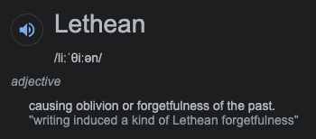

# OS Friendly Build System

"Forgetful Build System" 

Your project, your end users; this is just a build system.

‘Compatible Licences’ according to Article 5 EUPL are:

- GNU General Public License (GPL) v. 2, v. 3
- GNU Affero General Public License (AGPL) v. 3
- Open Software License (OSL) v. 2.1, v. 3.0
- Eclipse Public License (EPL) v. 1.0
- CeCILL v. 2.0, v. 2.1
- Mozilla Public Licence (MPL) v. 2
- GNU Lesser General Public Licence (LGPL) v. 2.1, v. 3
- Creative Commons Attribution-ShareAlike v. 3.0 Unported (CC BY-SA 3.0) for
  works other than software
- European Union Public Licence (EUPL) v. 1.1, v. 1.2
- Québec Free and Open-Source Licence — Reciprocity (LiLiQ-R) or Strong
  Reciprocity (LiLiQ-R+).

# Sponsors

Both Sponsors have free public access; meaning you are more than welcome to fork and use for yourself, for commercial projects, they have options for you too. 

## Build systems: Docker Inc
Docker Inc sponsor us with Opensource access, meaning the opensource community can leverage their very generous sponsorship, without affecting their personal quotas. 

With docker, Opensource developers have access to "pull and play" build environments, for any playform. <3 TY Docker 

* [lthn/build](https://hub.docker.com/r/lthn/build)
* [Docker Desktop](https://www.docker.com/products/docker-desktop)
* [Free & Paid Information](https://www.docker.com/pricing)

## Secure Build Environments: Kasm Workspaces 

With our concurrent licence sponsorship from [Kasm Workspaces](https://www.kasmweb.com/); we can not only test applications,
using [SANS SIFT Workstation](https://www.sans.org/tools/sift-workstation/);

We can build other OpenSource projects we partner / sponsor, so we can stand behind the code that produced a binary with fingerprint X; recorded in git, with its result in public domain.

folders depth to the `hour` depth of `timestamp_to_human(now)`; keyed with [mariadb](http://mariadb.com/kb/en/gtid/) - [gtid/](https://www.namebase.io/domains/gtid)

